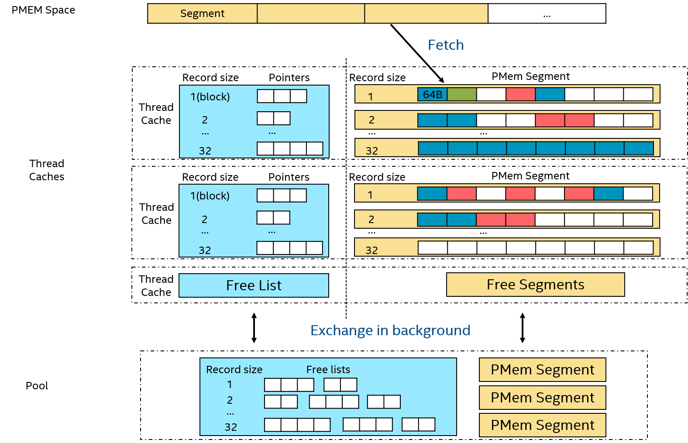

# PMem Allocator

## 结构

- PMEM Space: 从PMEM map出的一块空间，分为若干segment，每个segment又分成若干blocks，block是allocator的最小分配单元
- Thread caches：为前台线程cache一些可用空间，避免线程竞争。包括一组segment和free list。Free list管理被释放的空闲空间，是一个指针的数组，每个指针指向一段空闲空间。Cache为每种record size（若干个block）维护一个free list和segment，所有的allocate请求会将请求的空间大小对齐到某个record size。各free list中的所有指针均指向对应record size的空闲空间，同样，各segment只分配对应record size的空间
- Pool：为了均衡各thread cache的资源，由一个后台线程周期地将thread cache中的free list以及segment移动到后台的pool中(注：当前代码中未实现segment的移动），pool中的资源由所有前台线程共享

## 空间分配流程：
- 将请求分配的空间大小对齐到若干个block大小，线程查看cache中对应大小的segment是否有足够空间，若无，则从pool中拿取另一个segment。然后从segment末尾分配空间
- 若pool中仍无可用segment，则尝试从free list中分配空间。首先查看cache中对应大小的free list，若无可用空间，则从pool中拿取另一段free list
- 若从free list分配空间仍然失败，则从PMEM Space中fetch一段新的segment

## 空间释放：
- 将free的空间指针加入cache中对应大小的free list链表

# Viper Allocator

## 简介

## 比较本PMem Allocator与Viper Allocator

pro：

- PMem Allocator不在PMem上存储任何元数据，而Viper Allocator需要为每段空间管理bit map、size等元数据，因此PMem Allocator相比Viper Allocator在分配、释放空间时节省了对PMem的读写开销
- PMem Allocator直接由free list管理空闲空间，可以保证空闲空间被快速再利用，而Viper Allocator通过compaction机制来管理空闲空间，需要周期地移动每段空间的数据，存在额外的PMem读写开销，并且存在一致性问题

cons：
- PMem Allocator尚未支持碎片合并机制，若workload特征变化较大，长时间运行后可能产生较多碎片
- 若短时间释放大量空间而不使用，PMem Allocator的free list会占用较多内存